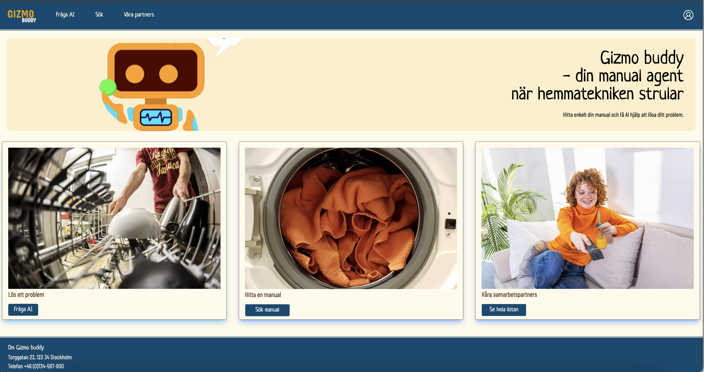

# Home Appliance Management System

A comprehensive solution for managing home appliances and electronics, making it easier for users to find and access product manuals, get assistance, and manage their devices effectively.



## Overview

This application helps users manage their home appliances and electronics by providing easy access to product manuals, AI-powered assistance, and a user-friendly interface for managing their devices.

## Key Features

### For Regular Users
- 📸 **Smart Manual Matching**: Take a photo of your device's label to automatically find the correct manual
- 📚 **Personal Manual Library**: Save and organize your device manuals in one place
- 🤖 **AI-Powered Assistance**: Get instant answers to your questions about your devices
- 🔍 **Easy Search**: Quickly find manuals and information about your devices


### For Administrators
- 👥 **User Management**: Add and manage user accounts
- 🔒 **Permission Control**: Set and manage user permissions
- 📊 **User Analytics**: Monitor user activity and engagement
- 🛡️ **Security Management**: Ensure system security and compliance

### For Manual Managers
- 📤 **Manual Upload**: Add new product manuals to the system
- 📈 **Usage Statistics**: Track how manuals are being used
- ⭐ **Popularity Metrics**: Monitor which manuals are most frequently accessed
- 🗑️ **Content Management**: Update or remove outdated manuals

## Getting Started

### Prerequisites
- Node.js (v14 or higher)
- Python 3.8 or higher
- A modern web browser

### Installation

1. Clone the repository:
```bash
git clone [repository-url]
```

2. Install dependencies:
```bash
# Install frontend dependencies
npm install

# Install backend dependencies
pip install -r requirements.txt
```

3. Set up environment variables:
```bash
cp .env.example .env
# Edit .env with your configuration
```

4. Start the development server:
```bash
# Start frontend
npm run dev

# Start backend
python app.py
```

## User Interface

The application features a clean, intuitive interface that makes it easy to:
- Upload and manage device manuals
- Search for specific devices
- Get AI-powered assistance
- Manage user accounts and permissions


## Contributing

We welcome contributions! Please read our contributing guidelines before submitting pull requests.

## License

This project is licensed under the MIT License - see the LICENSE file for details.

## Support

For support, please open an issue in the repository or contact our support team.

## Acknowledgments

- Thanks to all contributors who have helped shape this project
- Special thanks to the open-source community for their invaluable tools and libraries
